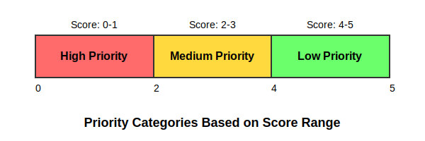

\AddToShipoutPictureFG{
\AtPageCenter{% or \AtTextCenter
\makebox[0pt]{\rotatebox[origin=c]{45}{%
\scalebox{10}{\texttransparent{0.1}{DRAFT}}%
}}
}
}


\newpage

# Introduction

Somalia is currently grappling with a prolonged crisis, marked by approximately 3.8 million internally displaced persons (IDPs). Many of these individuals have migrated from rural areas to urban centers due to a combination of environmental shocks, food insecurity, limited livelihood opportunities, and ongoing armed conflict. In response to this pressing issue, the Department of Poverty Reduction and Durable Solutions within the Ministry of Planning, Investments, and Economic Development (MoPIED) plays a pivotal role in managing and addressing solutions for internal displacement throughout the country.

In 2024, the department organized a series of consultations on durable solutions pathways across all federal member states and the Banadir Regional Administration (BRA). The primary objective of these consultations was to identify effective strategies to facilitate the durable solutions pathways for one million IDPs, helping them transition from their current displacement situations. This initiative aligns with the National Durable Solutions Strategy, the National Development Plan, and the United Nations Secretary-General’s Action Agenda on Internal Displacement. These frameworks emphasize three interconnected goals: achieving durable solutions, ensuring protection and assistance, and preventing future displacement.

The workshops held during these consultations were structured around several fundamental elements designed to address the complex needs of IDPs and facilitate durable solutions. The key elements forming the foundation for durable solutions pathways include:

1.  **Solutions Pathway 1:** Government Leadership – Strengthening governmental roles and responsibilities in implementing solutions.
2.  **Solutions Pathway 2:** Access to Basic Services – Ensuring that IDPs have access to essential services such as healthcare, education, and sanitation.
3.  **Solutions Pathway 3:** Employment and Livelihood Opportunities – Creating opportunities for sustainable livelihoods to enhance economic stability.
4.  **Solutions Pathway 4:** Legal Documentation, Housing, Land, and Property (HLP) – Addressing legal and housing issues to secure IDPs' rights to land and property.
5.  **Solutions Pathway 5:** Addressing Climate Change and Building Resilience – Focusing on strategies that mitigate the impacts of climate change and enhance community resilience.
6.  **Solutions Pathway 6:** Data for Solutions: Generating Reliable Data – Establishing reliable data collection methods to inform decision-making and policy formulation.

This report outlines a comprehensive methodology aimed at identifying priority locations for intervention specifically related to solutions pathways 2 through 5.

## Research questions

-   Identify priority locations for government fundraising efforts aligned with solution pathways.
-   Identify target demographic groups for each solution pathway

## Limitation

1.  In Somalia, there is a notable trend of internally displaced persons (IDPs) increasingly relocating to larger cities in search of better access to essential services and facilities. This influx places a significant burden on urban areas, which are often ill-equipped to support the high number of IDPs. As a result, the strain on resources in these cities can lead to overcrowding, increased competition for jobs, and heightened tension between IDPs and local residents. Research indicates that if essential services were made available in relatively smaller cities, a significant number of IDPs would be more likely to settle there instead of migrating to larger urban centers. This shift could alleviate some of the pressure on big cities while simultaneously fostering more balanced regional development. By investing in infrastructure and service provision in smaller towns, policymakers could create environments that attract IDPs, thus promoting their well-being and integration into local communities. However, the methods proposed in this report do not take this crucial aspect into account when determining intervention priorities.

2.  This methodology operates under the assumption that the data for all indicators related to each pathway is sourced from a single, unified data set

# Methodology

## Overview

The methodology utilizes a comprehensive multi-tiered scoring system designed to assess the current situation across various pathways. Each pathway encompasses several sub-criteria, which are composed of distinct, measurable indicators. This approach allows for a nuanced evaluation, as it breaks down each pathway into specific elements that can be quantified and analyzed.This structured methodology aims to provide a clear, detailed understanding of the current landscape, supporting informed decision-making and strategic planning.

## Data Processing Steps

Initially, each pathway will have multiple sub-indicators selected, with various indicators chosen under each sub-criterion. All indicators will then be converted to binary values, with "Pass" assigned a value of 1 and "Fail" a value of 0. Responses such as "Don't know" or "Prefer not to say" will be classified as "NA." Generally, "NA" responses will remain as such, though specific questions may require recoding these as "Pass" or "Fail" based on predetermined conditions. After recoding, sub-criteria scores will be calculated by applying equal weights and standardizing them on a 0–1 scale. Scores below 0.50 will be recorded as 0, while scores equal to or above 0.50 will be recorded as 1. This same methodology will be used to compute final pathway scores based on the sub-criteria.

## Case Study: HLP and Documentation (solutions pathway 4)

### Step 1: Indentifying the list of indicators

Let's take an example of HLP and documentation (solution pathway 4). Within this pathway, we have identified the following two sub-criteria and five indicators.

-   [Sub indicator] [4.1 HLP]{.underline}

-   4.1.1 % of households with a written agreement or land title deed for the land they occupy.
-   4.1.2 % of households reporting that no one attempted to evict them from their property in the past three months.
-   4.1.3 % of households facing negligible or no risk of eviction from their current property or land.
-   4.1.4 % of households that have never or rarely been involved in disputes or conflicts related to access to the land they occupy in the past three months.

-   [Sub indicator] [4.2 Documentation]{.underline}

-   4.2.1 % of households with either a birth certificate, ID, passport, or marriage certificate.

In the next sections we will create a comprehensive matrix step by step for HLP and Documentation pathways using **dummay data**

### Step 2: Collect household-level data for all indicators

The next step after identifying the indicators is to collect household-level data for each indicator by city. Potential data sources include:

1.  Durable Solution Progress (DSP) Survey
2.  Service Analysis and Mapping
3.  Area-Based Assessments
4.  MSNA

*However, for this purpose, the DSP and Service Analysis and Mapping may be more suitable, as these two surveys are specifically designed to gather information at the neighborhood level.*

Let’s assume we have the following dataset that includes all indicators for solution pathway 4: HLP and legal documentation.


\begin{longtable}[t]{lllll}
\caption{\label{tab:hh_data}Sample HH data for seleted indicators}\\
\toprule
HH\_id & Ind-4.1.1 & Ind-4.1.2 & Ind-4.1.3 & Ind-4.1.4\\
\midrule
1 & Verbal agreement & Facing eviction thread & High risk & Often\\
2 & Written agreement & No eviction thread & Low risk & Never\\
3 & No agreement & Facing eviction thread & High risk & Sometimes\\
4 & Dont know & No eviction thread & Negligible & Rarely\\
5 & Verbal agreement & Facing eviction thread & No risk & Never\\
\bottomrule
\end{longtable}

Now we will recode the data according to the definitions established in Step 1. The rules will be as follows:

1.  Ind-4.1.1:
-   Pass (1): Written agreement and land title deed
-   Fail (0): No agreement, verbal agreement
-   NA: Don't know/Prefer not to say
2.  Ind-4.1.2:
-   Pass (1): No eviction threat
-   Fail (0): Facing eviction threat
-   NA: Don't know/Prefer not to say
3.  Ind-4.1.3:
-   Pass (1): No risk or negligible
-   Fail (0): Low or high risk
-   NA: Don't know/Prefer not to say
4.  Ind-4.1.4:
-   Pass (1): Never or rarely
-   Fail (0): Often or sometimes
-   NA: Don't know/Prefer not to say


\begin{longtable}[t]{ccccc}
\caption{\label{tab:indicator_recoding}Indicator Recoding to Binary Value}\\
\toprule
HH\_id & Ind-4.1.1 & Ind-4.1.2 & Ind-4.1.3 & Ind-4.1.4\\
\midrule
1 & 0 & 0 & 0 & 0\\
2 & 1 & 1 & 0 & 1\\
3 & 0 & 0 & 0 & 0\\
4 & NA & 1 & 1 & 1\\
5 & 0 & 0 & 1 & 1\\
\bottomrule
\end{longtable}

### Step 3: Create composite indicator at sub-criteria level

In this example, we will now create a composite score for the sub-criteria using the following equation:

\begin{equation}
`Sub Criteria` = (`Sum of all non-NA indicators`)/(`Number of non-NA indicators`)
\end{equation}


\begin{longtable}[t]{ccccc>{}c}
\caption{\label{tab:compisite}Sub-Criteria Calculation for HLP and Documentation Pathway}\\
\toprule
HH\_id & Ind-4.1.1 & Ind-4.1.2 & Ind-4.1.3 & Ind-4.1.4 & Sub-ind-4.1\\
\midrule
1 & 0 & 0 & 0 & 0 & \cellcolor{cyan}{\textcolor{black}{\textbf{0.00}}}\\
2 & 1 & 1 & 0 & 1 & \cellcolor{cyan}{\textcolor{black}{\textbf{0.75}}}\\
3 & 0 & 0 & 0 & 0 & \cellcolor{cyan}{\textcolor{black}{\textbf{0.00}}}\\
4 & NA & 1 & 1 & 1 & \cellcolor{cyan}{\textcolor{black}{\textbf{1.00}}}\\
5 & 0 & 0 & 1 & 1 & \cellcolor{cyan}{\textcolor{black}{\textbf{0.50}}}\\
\bottomrule
\end{longtable}

### Step 4: Applying recoding rule on composite indicator

Once the sub indicator is created, we will recode using the following rule:

```         
- If composite score >= 0.50 → Pass (1)
- If composite score < 0.50 → Fail (0)
```


\begin{longtable}[t]{ccccc>{}c}
\caption{\label{tab:compisite_recode}Recoding Sub-Criteria for HLP and Documentation Pathway}\\
\toprule
HH\_id & Ind-4.1.1 & Ind-4.1.2 & Ind-4.1.3 & Ind-4.1.4 & Sub-ind-4.1\\
\midrule
1 & 0 & 0 & 0 & 0 & \cellcolor{cyan}{\textcolor{black}{\textbf{0}}}\\
2 & 1 & 1 & 0 & 1 & \cellcolor{cyan}{\textcolor{black}{\textbf{1}}}\\
3 & 0 & 0 & 0 & 0 & \cellcolor{cyan}{\textcolor{black}{\textbf{0}}}\\
4 & NA & 1 & 1 & 1 & \cellcolor{cyan}{\textcolor{black}{\textbf{1}}}\\
5 & 0 & 0 & 1 & 1 & \cellcolor{cyan}{\textcolor{black}{\textbf{1}}}\\
\bottomrule
\end{longtable}

### Step 5: Applying same calculations for all sub criteria for each pathway

Using the same calculation method, we will calculate the scores for all sub-criteria. In this specific example, we will calculate the remaining sub-criteria `(Sub-Ind-4.2)` for HLP and documents.


\begin{longtable}[t]{ccccc>{}cc>{}c}
\caption{\label{tab:pathway_4_tbl}Sub-Criteria Score for HLP and Documentation Pathway}\\
\toprule
HH\_id & Ind-4.1.1 & Ind-4.1.2 & Ind-4.1.3 & Ind-4.1.4 & Sub-ind-4.1 & Ind-4.2.2 & Sub-ind-4.2\\
\midrule
1 & 0 & 0 & 0 & 0 & \cellcolor{cyan}{\textcolor{black}{\textbf{0}}} & 1 & \cellcolor{cyan}{\textcolor{black}{\textbf{1}}}\\
2 & 1 & 1 & 0 & 1 & \cellcolor{cyan}{\textcolor{black}{\textbf{1}}} & 0 & \cellcolor{cyan}{\textcolor{black}{\textbf{0}}}\\
3 & 0 & 0 & 0 & 0 & \cellcolor{cyan}{\textcolor{black}{\textbf{0}}} & 0 & \cellcolor{cyan}{\textcolor{black}{\textbf{0}}}\\
4 & NA & 1 & 1 & 1 & \cellcolor{cyan}{\textcolor{black}{\textbf{1}}} & 0 & \cellcolor{cyan}{\textcolor{black}{\textbf{0}}}\\
5 & 0 & 0 & 1 & 1 & \cellcolor{cyan}{\textcolor{black}{\textbf{1}}} & 1 & \cellcolor{cyan}{\textcolor{black}{\textbf{1}}}\\
\bottomrule
\end{longtable}

### Step 6: Calculating total score

Once we have score for all sub criteria, we will calculate the pathway score by applying simple sum.

\begingroup\fontsize{8}{10}\selectfont

\begin{longtable}[t]{ccccc>{}cc>{}c>{}c}
\caption{\label{tab:pathway_4_tbl_total}Total Score for HLP and Documentation Pathway}\\
\toprule
HH\_id & Ind-4.1.1 & Ind-4.1.2 & Ind-4.1.3 & Ind-4.1.4 & Sub-ind-4.1 & Ind-4.2.2 & Sub-ind-4.2 & Total-Score\\
\midrule
1 & 0 & 0 & 0 & 0 & \cellcolor{cyan}{\textcolor{black}{\textbf{0}}} & 1 & \cellcolor{cyan}{\textcolor{black}{\textbf{1}}} & \cellcolor{teal}{\textcolor{black}{\textbf{1}}}\\
2 & 1 & 1 & 0 & 1 & \cellcolor{cyan}{\textcolor{black}{\textbf{1}}} & 0 & \cellcolor{cyan}{\textcolor{black}{\textbf{0}}} & \cellcolor{teal}{\textcolor{black}{\textbf{1}}}\\
3 & 0 & 0 & 0 & 0 & \cellcolor{cyan}{\textcolor{black}{\textbf{0}}} & 0 & \cellcolor{cyan}{\textcolor{black}{\textbf{0}}} & \cellcolor{teal}{\textcolor{black}{\textbf{0}}}\\
4 & NA & 1 & 1 & 1 & \cellcolor{cyan}{\textcolor{black}{\textbf{1}}} & 0 & \cellcolor{cyan}{\textcolor{black}{\textbf{0}}} & \cellcolor{teal}{\textcolor{black}{\textbf{1}}}\\
5 & 0 & 0 & 1 & 1 & \cellcolor{cyan}{\textcolor{black}{\textbf{1}}} & 1 & \cellcolor{cyan}{\textcolor{black}{\textbf{1}}} & \cellcolor{teal}{\textcolor{black}{\textbf{2}}}\\
\bottomrule
\end{longtable}
\endgroup{}

### Step 7: Creating City-Level Matrix for HLP and Documentation Pathway

Finally, we will develop a city-level matrix by calculating the percentage of passes for each indicator and sub-indicator, as well as the average total score for each city.

\begingroup\fontsize{8}{10}\selectfont

\begin{longtable}[t]{>{\centering\arraybackslash}p{.5in}>{}c>{}c>{}c>{}c>{}c>{}c>{}c>{\centering\arraybackslash}p{.4in}}
\caption{\label{tab:matrix}City-Level Matrix for HLP and Documentation Pathway}\\
\toprule
\multicolumn{1}{c}{ } & \multicolumn{5}{c}{\% passes Sub Indicator 1} & \multicolumn{2}{c}{\% passes Sub Indicator 2} & \multicolumn{1}{c}{ } \\
\cmidrule(l{3pt}r{3pt}){2-6} \cmidrule(l{3pt}r{3pt}){7-8}
City & Ind-4.1.1 & Ind-4.1.2 & Ind-4.1.3 & Ind-4.1.4 & Sub-ind-4.1 & Ind-4.2.2 & Sub-ind-4.2 & Total score (Mean)\\
\midrule
\textbf{Baardheere} & \textcolor[HTML]{440154}{\textbf{\textbf{40}}} & \textcolor[HTML]{355F8D}{\textbf{\textbf{50}}} & \textcolor[HTML]{FDE725}{\textbf{\textbf{88}}} & \textcolor[HTML]{440154}{\textbf{\textbf{35}}} & \textcolor[HTML]{482576}{\textbf{\textbf{70}}} & \textcolor[HTML]{3B528B}{\textbf{\textbf{55}}} & \textcolor[HTML]{3B528B}{\textbf{\textbf{55}}} & \textcolor[HTML]{306A8E}{\textbf{1.20}}\\
\textbf{Baydhaba} & \textcolor[HTML]{34618D}{\textbf{\textbf{56}}} & \textcolor[HTML]{25AB82}{\textbf{\textbf{67}}} & \textcolor[HTML]{50C46A}{\textbf{\textbf{80}}} & \textcolor[HTML]{B2DD2D}{\textbf{\textbf{66}}} & \textcolor[HTML]{50C46A}{\textbf{\textbf{88}}} & \textcolor[HTML]{50C46A}{\textbf{\textbf{76}}} & \textcolor[HTML]{50C46A}{\textbf{\textbf{76}}} & \textcolor[HTML]{1F9F88}{\textbf{1.40}}\\
\textbf{Berdaale} & \textcolor[HTML]{BDDF26}{\textbf{\textbf{87}}} & \textcolor[HTML]{440154}{\textbf{\textbf{34}}} & \textcolor[HTML]{20A486}{\textbf{\textbf{76}}} & \textcolor[HTML]{22A884}{\textbf{\textbf{56}}} & \textcolor[HTML]{440154}{\textbf{\textbf{67}}} & \textcolor[HTML]{3E4C8A}{\textbf{\textbf{54}}} & \textcolor[HTML]{3E4C8A}{\textbf{\textbf{54}}} & \textcolor[HTML]{440154}{\textbf{0.89}}\\
\textbf{Doolow} & \textcolor[HTML]{31B57B}{\textbf{\textbf{74}}} & \textcolor[HTML]{FDE725}{\textbf{\textbf{88}}} & \textcolor[HTML]{E7E419}{\textbf{\textbf{87}}} & \textcolor[HTML]{FDE725}{\textbf{\textbf{70}}} & \textcolor[HTML]{FDE725}{\textbf{\textbf{96}}} & \textcolor[HTML]{228B8D}{\textbf{\textbf{65}}} & \textcolor[HTML]{228B8D}{\textbf{\textbf{65}}} & \textcolor[HTML]{1F9F88}{\textbf{1.40}}\\
\textbf{Kismaayo} & \textcolor[HTML]{1F9E89}{\textbf{\textbf{69}}} & \textcolor[HTML]{470E61}{\textbf{\textbf{36}}} & \textcolor[HTML]{440154}{\textbf{\textbf{59}}} & \textcolor[HTML]{8BD646}{\textbf{\textbf{64}}} & \textcolor[HTML]{481B6D}{\textbf{\textbf{69}}} & \textcolor[HTML]{FDE725}{\textbf{\textbf{88}}} & \textcolor[HTML]{FDE725}{\textbf{\textbf{88}}} & \textcolor[HTML]{25AC82}{\textbf{1.45}}\\
\addlinespace
\textbf{MogDaynile} & \textcolor[HTML]{443B84}{\textbf{\textbf{49}}} & \textcolor[HTML]{77D153}{\textbf{\textbf{77}}} & \textcolor[HTML]{60CA60}{\textbf{\textbf{81}}} & \textcolor[HTML]{69CD5B}{\textbf{\textbf{62}}} & \textcolor[HTML]{31B57B}{\textbf{\textbf{86}}} & \textcolor[HTML]{50C46A}{\textbf{\textbf{76}}} & \textcolor[HTML]{50C46A}{\textbf{\textbf{76}}} & \textcolor[HTML]{20A486}{\textbf{1.42}}\\
\textbf{MogKahda} & \textcolor[HTML]{CAE11F}{\textbf{\textbf{88}}} & \textcolor[HTML]{297A8E}{\textbf{\textbf{56}}} & \textcolor[HTML]{75D054}{\textbf{\textbf{82}}} & \textcolor[HTML]{32B67A}{\textbf{\textbf{58}}} & \textcolor[HTML]{50C46A}{\textbf{\textbf{88}}} & \textcolor[HTML]{EFE51C}{\textbf{\textbf{87}}} & \textcolor[HTML]{EFE51C}{\textbf{\textbf{87}}} & \textcolor[HTML]{FDE725}{\textbf{1.80}}\\
\textbf{Xudur} & \textcolor[HTML]{FDE725}{\textbf{\textbf{92}}} & \textcolor[HTML]{21A685}{\textbf{\textbf{66}}} & \textcolor[HTML]{3C508B}{\textbf{\textbf{66}}} & \textcolor[HTML]{58C765}{\textbf{\textbf{61}}} & \textcolor[HTML]{443B84}{\textbf{\textbf{72}}} & \textcolor[HTML]{440154}{\textbf{\textbf{44}}} & \textcolor[HTML]{440154}{\textbf{\textbf{44}}} & \textcolor[HTML]{26828E}{\textbf{1.29}}\\
\bottomrule
\end{longtable}
\endgroup{}

**Interpretation:** The matrix above effectively addresses our first research question. For instance, by examining the `Total score (mean)` column, we can see that `Berdaale` has the lowest score, indicating that it should be prioritized over other cities for any HLP (Housing, Land, and Property) or documentation-related projects. A closer look reveals that only `34%` of cases pass for indicator `4.1.2`, which assesses the presence of solutions for eviction threats. This low pass rate suggests that Berdaale urgently requires targeted HLP solutions to address eviction risks, more so than other locations. Thus, the matrix not only identifies priority areas but also highlights specific needs within those areas to inform strategic project deployment."


### Step 8: Normalizating the total score

Since solution paths have different numbers of subcriteria, their total scores will naturally have different ranges. To make scores easily comparable across all solution paths, we will normalize them to a 0-5 scale using the standard normalization equation:

`Total score` = ((`Total score(mean)` - min)/(max-min))*5

\begingroup\fontsize{8}{10}\selectfont

\begin{longtable}[t]{cccccccc>{}c}
\caption{\label{tab:matrix2}City-Level Matrix for HLP and Documentation Pathway}\\
\toprule
City & Ind-4.1.1 & Ind-4.1.2 & Ind-4.1.3 & Ind-4.1.4 & Sub-ind-4.1 & Ind-4.2.2 & Sub-ind-4.2 & Total score\\
\midrule
Baardheere & 40 & 50 & 88 & 35 & 70 & 55 & 55 & \cellcolor{teal}{\textcolor{black}{\textbf{2}}}\\
Baydhaba & 56 & 67 & 80 & 66 & 88 & 76 & 76 & \cellcolor{teal}{\textcolor{black}{\textbf{3}}}\\
Berdaale & 87 & 34 & 76 & 56 & 67 & 54 & 54 & \cellcolor{teal}{\textcolor{black}{\textbf{0}}}\\
Doolow & 74 & 88 & 87 & 70 & 96 & 65 & 65 & \cellcolor{teal}{\textcolor{black}{\textbf{3}}}\\
Kismaayo & 69 & 36 & 59 & 64 & 69 & 88 & 88 & \cellcolor{teal}{\textcolor{black}{\textbf{3}}}\\
\addlinespace
MogDaynile & 49 & 77 & 81 & 62 & 86 & 76 & 76 & \cellcolor{teal}{\textcolor{black}{\textbf{3}}}\\
MogKahda & 88 & 56 & 82 & 58 & 88 & 87 & 87 & \cellcolor{teal}{\textcolor{black}{\textbf{5}}}\\
Xudur & 92 & 66 & 66 & 61 & 72 & 44 & 44 & \cellcolor{teal}{\textcolor{black}{\textbf{2}}}\\
\bottomrule
\end{longtable}
\endgroup{}

### Step 9: Defining the prirority 

In the final stage, the cities will be classified into three priority categories based on their scores:

High Priority: 0-1
Medium Priority: 2-3
Low Priority: 4-5"


```r
# Most straightforward method

```

<!-- --> 


## Conclusion

This methodology provides a structured approach to prioritizing IDP solutions in Somalia. By implementing this framework, stakeholders can make informed decisions about resource allocation and intervention strategies, ultimately supporting more effective durable solutions for displaced populations.

# Annex

## List of available Indicators in DSP

To assess the current state of each solution path, initially, core indicators were selected. These indicators were chosen based on the context in Somalia, readily available datasets, IASC criteria, and the action plan.

### Solutions Pathway 1: Government Leadership

##### Trust & Governance Indicators
- [T.4] % HH by perception of government responsiveness
- [T.5] % HH by perception of government inclusivity
- [T.2] % HH reporting government visits
- [S.5] Average trust scores for local authorities
- [T.1] % HH participating in community groups
- [T.3] % HH by public meeting attendance frequency

##### Security & Justice
- [U.1] % HH with legal services access
- [U.2] % HH by justice system preferences
- [U.3] % HH by justice system effectiveness rating
- [S.4] Average trust scores for security services
- [S.3] Average trust scores for justice system

### Solutions Pathway 2: Access to Basic Services

##### Education Access
- [E.1] % HH by highest female education level
- [E.2] % HH by highest male education level
- [E.3] Average number of boys (5-17) attending school
- [E.4] Average number of girls (5-17) attending school
- [E.8] % HH by education barriers
- [E.9] % HH by travel time to school
- [E.10] % HH by school meal provision
- [S.2] Average trust scores for education system

##### Health Access
- [J.1] % HH by healthcare access points
- [J.2] % HH by travel time to health center
- [J.3] % HH receiving needed healthcare
- [J.4] % HH by healthcare access barriers
- [S.1] Average trust scores for health system

##### WASH Services
- [K.1] % HH by drinking water sources
- [K.2] % HH with safe water source access
- [K.3] % HH by water access time
- [K.4, K.5] % HH with sufficient water (rainy/dry seasons)
- [K.6] % HH by water access barriers
- [K.7] % HH by latrine type
- [K.8] Average number of people sharing latrine
- [K.9] % HH with safe latrine access
- [K.10] % HH by latrine access barriers

##### Basic Infrastructure
- [N.1] % HH by power sources
- [N.2] % HH by power access barriers
- [M.1] % HH by transportation access barriers
- [O.1] % HH by main information sources

### Solutions Pathway 3: Employment and Livelihood Opportunities

##### Income & Employment
- [F.1] % HH able to meet basic needs independently
- [F.3] % HH by main income sources
- [F.4] % HH by primary earner's occupational status
- [G.1] Average monthly HH income (excluding transfers)
- [G.2] % HH receiving money transfers by source

##### Financial Inclusion
- [H.1] % HH with debt by purpose
- [H.2] % HH by debt sources
- [H.3] % HH by available credit options
- [H.4] % HH by loan access challenges
- [H.5] % HH with savings
- [H.6] % HH with financial institution accounts
- [H.6.1] % HH by financial services usage
- [S.6] Average trust scores for financial institutions

##### Food Security & Markets
- [I.1] % HH by main food source
- [I.2] % HH with safe food source access
- [I.3] % HH by market access time
- [I.4] % HH by food intake frequency
- [I.5] % HH experiencing food insecurity
- [I.6] % HH by food access barriers

##### Coping Mechanisms
- [F.2] % HH relying on external assistance
- [F.5] % HH using various coping mechanisms

### Solutions Pathway 4: Legal Documentation, Housing, Land, and Property

##### Housing & Land Rights
- [L.1] % HH by housing ownership status
- [L.2] % HH by property documentation type
- [L.3] % HH by shelter type
- [L.4] % HH by housing quality issues
- [L.5] % HH by land ownership status
- [L.7] % HH by land documentation type
- [L.8] % HH by housing access barriers
- [L.9] % HH involved in land disputes
- [L.13] % HH by eviction risk level
- [L.15] Average number of structures per HH

##### Legal Documentation
- [L.14] % HH by legal documentation possession

### Solutions Pathway 5: Addressing Climate Change and Building Resilience

##### Climate Adaptation
- [P.1] % HH taking climate adaptation measures
- [P.1.1] % HH by type of adaptation measures

##### Community Resilience
- [R.1] % HH by displaced-host community relations rating
- [R.2, R.3] % HH with youth social integration
- [R.4] % HH included in community events
- [R.5] Average inter-community trust level
- [Q.1, Q.2] % HH by safety perception level
- [Q.3] % HH with male freedom of movement
- [Q.4] % HH with female freedom of movement
- [Q.5] % HH by movement restrictions
- [Q.6] % HH experiencing violence
- [Q.7] % HH receiving post-violence assistance

**Note:** Many indicators can serve multiple pathways and inform different aspects of solutions. This classification represents the primary alignment of each indicator with the solution pathways while acknowledging their interconnected nature.

------------------------------------------------------------------------
